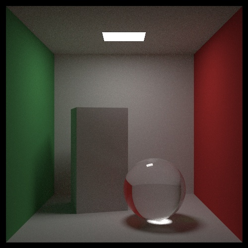

## Ray tracing: the rest of your life, in Rust

This is an implementation in Rust of [Peter Shirley's "Ray Tracing: The Rest Of Your Life"](https://raytracing.github.io/books/RayTracingTheRestOfYourLife.html) book.
This is the third of the series:

- [Ray tracing in one weekend, in Rust](https://github.com/fralken/ray-tracing-in-one-weekend)
- [Ray tracing: the next week, in Rust](https://github.com/fralken/ray-tracing-the-next-week)
- Ray tracing: the rest of your life, in Rust

Every tagged commit is the code that generates a specific image. In this way it's easy to follow the progress in the book.
First `git clone` this project. Then you can checkout a `tag` to retrieve the implementation at a specific chapter in the book.
For example, with `git checkout tags/chapter_08.2` you get the implementation for the second image of chapter 8.
With `git checkout master` you go back to the latest version. 

Instead of implementing my own `vec3`, I preferred using `Vector3` from [`nalgebra`](https://crates.io/crates/nalgebra) crate.
For random numbers I used [`rand`](https://crates.io/crates/rand).

The initial code base is that of the previous project, without the stuff not used in this one, such as `bvh`, image textures, and so on.
The main loop is made parallel with the [`rayon`](https://crates.io/crates/rayon) crate.

Hence dependencies are:
- [`nalgebra`](https://www.nalgebra.org)
- [`rand`](https://rust-random.github.io/book/)
- [`rayon`](https://github.com/rayon-rs/rayon)

